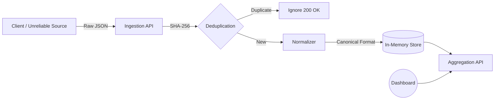

# 🛡️ Fault-Tolerant Data Processing System


A robust, fault-tolerant ingestion service designed to normalize unreliable data streams, handle partial failures gracefully, and provide consistent aggregated insights. Built for resilience and scale.

---

## 🏗️ Architecture



## 🚀 Key Features

- **🛡️ Content-Based Deduplication**: Uses SHA-256 hashing of raw payloads to ensure Idempotency. Retries never corrupt data.
- **🔧 Intelligent Normalization**: Heuristic mappers automatically detect `cost`, `value`, `amount` and timestamps across varying schemas.
- **💥 Failure Simulation**: Built-in chaos engineering toggle to simulate random DB failures (500 errors) and verify client retry safety.
- **📊 Real-time Aggregation**: Instant insights grouped by client source.

---

## 🛠️ How to Run

### Prerequisities
- Node.js (v14+)

### 1. Backend (Port 3000)
```bash
cd server
npm install
npm start
```

### 2. Frontend (Port 5173/5174/5175)
```bash
cd client
npm install
npm run dev
```

---

## 📝 Design Decisions & Assignment Answers

### 1. What assumptions did you make?
- **Data Volatility**: I assumed input fields are extremely volatile. The system uses a **heuristic normalizer** that scans for keywords like `amount`, `cost`, `value` rather than validating against a strict schema.
- **Identity Strategy**: Since clients provide no reliable ID, identity is derived from the **content hash** of the raw payload. Exact JSON duplicates are treated as retries.
- **Persistence**: Given the constraints, the system uses an in-memory structure (singleton class) for high-speed access, acknowledging state is lost on restart.

### 2. How does your system prevent double counting?
**Content-Based Deduplication (Idempotency)**.
1.  Every incoming payload is hashed (`SHA-256`).
2.  This hash is checked against a `Set<String>` of processed transaction hashes.
3.  **Hit**: The request is ignored (returns `200 OK` to stop client retries) and stats are **not** incremented.
4.  **Miss**: The event is processed, and the hash is stored.

### 3. What happens if the database fails mid-request?
The system utilizes a **Check-then-Act** atomic flow for the simulation:
- If the "Database Write" fails (simulated 500 status), the transaction is **aborted** immediately.
- The `processedHashes` set is **not** updated.
- The stats are **not** updated.
- The client receives an error and is expected to retry.
- **Result**: Zero data corruption. Zero double counting on valid retry.

### 4. What would break first at scale?
1.  **Memory Pressure**: The in-memory `processedHashes` Set will grow O(n). In production, this must be moved to **Redis** with a TTL (Time-To-Live).
2.  **Event Loop Blocking**: High-volume hashing (SHA-256) on the main Node.js thread could block I/O. We would need to offload this to worker threads or an API Gateway.
3.  **Race Conditions**: In a load-balanced environment (multiple server instances), two identical requests hitting two servers simultaneously would bypass local memory deduplication. We would need to use a distributed lock or unique constraint in a shared database.

---

## 📂 Project Structure

```bash
/server
  ├── index.js       # Express Entry Point
  ├── ingest.js      # Main Controller (Validation & Logic)
  ├── normalizer.js  # Schema Standardization
  └── store.js       # In-Memory Database & State
/client
  ├── src/App.jsx    # Dashboard & Simulation UI
  └── src/index.css  # Modern Dark UI Styling
```
#
